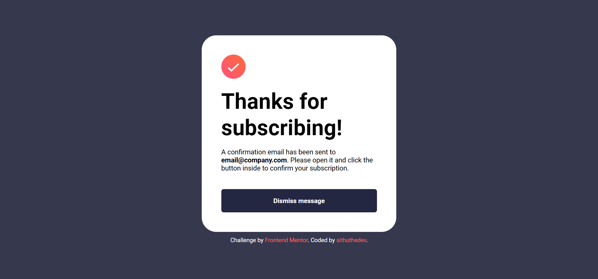

# Frontend Mentor - Newsletter sign-up form with success message solution

This is my solution to the [Newsletter sign-up form with success message challenge on Frontend Mentor](https://www.frontendmentor.io/challenges/newsletter-signup-form-with-success-message-3FC1AZbNrv).

## Table of contents

- [Overview](#overview)
  - [The challenge](#the-challenge)
  - [Screenshot](#screenshot)
  - [Links](#links)
- [My process](#my-process)
  - [Built with](#built-with)
  - [What I learned](#what-i-learned)
  - [Continued development](#continued-development)
  - [Useful resources](#useful-resources)
- [Author](#author)
- [Acknowledgments](#acknowledgments)

## Overview

### The challenge

In this challenge I had to build a newsletter sign-up page that users can:

- Add their email and submit the form
- See a success message with their email after successfully submitting the form
- See form validation messages if:
  - The field is left empty
  - The email address is not formatted correctly
- View the optimal layout for the interface depending on their device's screen size
- See hover and focus states for all interactive elements on the page

### Screenshot

#### Sign-Up Form


#### Success Message


### Links

- Solution URL: [Click Here](https://www.frontendmentor.io/solutions/newsletter-signup-form-challenge-vonmhJ4xvg)
- Live Site URL: [Click Here](https://newsletter-signup-page-by-sithuthedev.netlify.app/)

## My process

### Built with

- Semantic HTML5 markup
- CSS custom properties
- Flexbox
- JavaScript

### What I learned

##### Adjusting Text Boldness: A Creative Solution
- While working on the project, I faced a unique challenge—getting the text boldness just right. The available options were 500 bold weight and 600 bold weight, but my preferred level of boldness fell in between.
- Opting for 500 made the text too light, while 600 made it overly bold. Searching for a fix, I discovered an ingenious solution with ChatGPT. Instead of changing the font weight, I used a text-shadow effect. This simple trick allowed me to achieve the perfect boldness for the text, meeting my requirements exactly.

This experience not only solved my challenge but also taught me a new way to approach styling.
##### Mini lessons

- I learned how to add svg files to HTML.
- I learned that I can import image/svg in in <ul> element using ```list-style-image: url(); ```
- When selecting elements in JS (```getElementById``` or ```querySelector```), it's important to be cautious and include the appropriate object (```document```). I was able to identify this issue only after 30 minutes of headache.
- In certain situations, styling based on elements proves to be more effective..
- Utilizing ```"font-family: inherit"``` within an input element is a clever method for inheriting the font family from its parent element.
- Using a transition effect (```"transition: all 1s"```) when hovering over a button adds an appealing touch.
- I discovered the simplicity of the ```.hide``` class with ```display: none``` prpperty to manipulate displaying elements effortlessly.
- using definite pixel width in main/card element is a good practice.

### Useful resources

- [Example resource 1](https://www.example.com) - This helped me for XYZ reason. I really liked this pattern and will use it going forward.
- [Example resource 2](https://www.example.com) - This is an amazing article which helped me finally understand XYZ. I'd recommend it to anyone still learning this concept.

## Author

- Website - [Sithu Aung Khant](https://www.your-site.com)
- Frontend Mentor - [@yourusername](https://www.frontendmentor.io/profile/yourusername)
- Twitter - [@Sithu_AungKhant](https://twitter.com/Sithu_AungKhant)

**Note: Delete this note and add/remove/edit lines above based on what links you'd like to share.**

## Acknowledgments

This is where you can give a hat tip to anyone who helped you out on this project. Perhaps you worked in a team or got some inspiration from someone else's solution. This is the perfect place to give them some credit.

**Note: Delete this note and edit this section's content as necessary. If you completed this challenge by yourself, feel free to delete this section entirely.**
